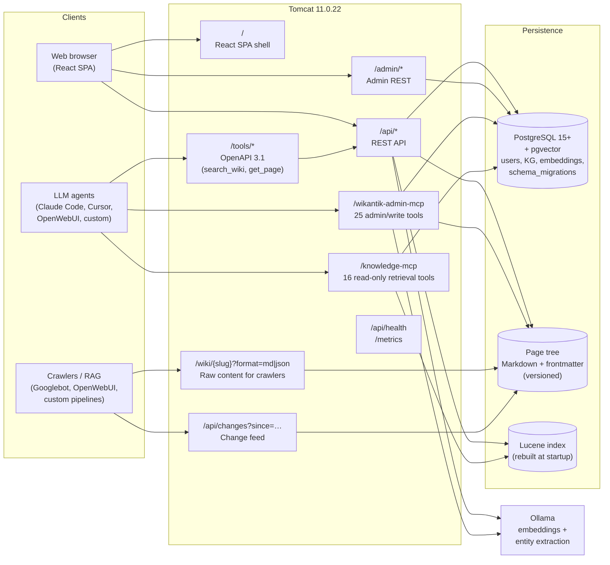

# Wikantik

[](LICENSE)
[](https://openjdk.org/projects/jdk/21/)
[](https://www.postgresql.org/)
[](https://tomcat.apache.org/)
[](https://github.com/jakefearsd/wikantik/actions/workflows/release.yml)
[](https://github.com/jakefearsd/wikantik/commits/main)
[](CODE_OF_CONDUCT.md)

> A Markdown-native knowledge base built for the agent era —
> hybrid retrieval (BM25 + dense + KG-rerank), two MCP servers for
> AI assistants, full Tomcat 11 / PostgreSQL + pgvector backend.

Licensed under the Apache License 2.0 — see [`LICENSE`](LICENSE) and
[`NOTICE`](NOTICE).

## What is Wikantik?

Wikantik is a modular Java-based knowledge base platform built on JEE technologies. It combines a Markdown-native authoring system with a React single-page application, a REST API, two dedicated Model Context Protocol (MCP) servers for AI agent integration, an OpenAPI tool server for non-MCP clients, and a full observability stack. Content is organised into thematic clusters with structured frontmatter metadata, indexed by Lucene for full-text and faceted search, and ranked by a hybrid BM25 + dense-vector + Knowledge Graph retrieval pipeline.

**Page Graph vs Knowledge Graph.** Wikantik distinguishes two graph
subsystems: the *Page Graph* (edges are real wikilinks; reader-facing
at `/page-graph`) and the *Knowledge Graph* (LLM-extracted entities and
relations; admin and agent surfaces). See [PageGraphVsKnowledgeGraph](docs/wikantik-pages/PageGraphVsKnowledgeGraph.md)
for the long form.

Key capabilities:

- **Markdown rendering** with Flexmark — fenced code blocks, tables, footnotes, definition lists, TOC generation, wiki-style internal links, and LaTeX math (see [MathematicalNotation.md](docs/MathematicalNotation.md))
- **React SPA** served at `/` — editorial magazine aesthetic with dark mode, metadata chips, change history, similar-pages panel, and inline editing
- **Page Graph** at `/page-graph` — interactive Cytoscape visualisation of the wikilink graph (backlinks, frontmatter, clusters) with semantic zoom, edge-type filtering, and parallel-edge merging
- **Knowledge Graph viewer** at `/knowledge-graph` — reader-facing visualisation of the LLM-extracted entity graph with tier filter, node-type colours, provenance/status badges, and a large-graph warning gate
- **REST API** at `/api/` — full CRUD for pages, attachments, search, history, diffs, backlinks, and the Knowledge Graph snapshot, with ACL-based permission enforcement
- **Admin MCP server** at `/wikantik-admin-mcp` — 25 tools (page writes, Page Graph link analysis, metadata queries, Knowledge Graph proposals, structural audits, verification stamping), 6 resources, 8 prompts, 3 completions. Bearer-token / API-key authenticated.
- **Knowledge MCP server** at `/knowledge-mcp` — 16 read-only tools for hybrid retrieval (BM25 + dense + Knowledge Graph rerank), Knowledge Graph traversal, structural-spine navigation (`list_clusters`, `list_tags`, `list_pages_by_filter`), schema discovery, the agent-grade `get_page_for_agent` projection, and batched markdown reads via `read_pages`. Same auth scheme.
- **OpenAPI tool server** at `/tools/*` — OpenWebUI-compatible OpenAPI 3.1 endpoint exposing `search_wiki` and `get_page` for non-MCP LLM clients
- **Raw content and change feed** — `GET /wiki/{slug}?format=md|json` and `GET /api/changes?since=…` for search-engine crawlers and RAG ingestion pipelines (see [IndexingSupport.md](IndexingSupport.md))
- **Hybrid retrieval** — BM25 + dense embeddings fused via Reciprocal Rank Fusion (RRF, k=60), with Knowledge Graph-aware rerank; fails closed to BM25 when the embedding service is unavailable (see [docs/wikantik-pages/HybridRetrieval.md](docs/wikantik-pages/HybridRetrieval.md))
- **Admin panel** at `/admin/` — user management, content management (orphaned pages, broken links, version purging, cache stats), security management (groups and policy grants)
- **Database-backed authorisation** — policy grants and groups stored in PostgreSQL, manageable through the admin UI, with bootstrap admin override for recovery
- **Observability** — health checks, Prometheus metrics at `/metrics` (IP-restricted to internal networks), structured logging with request correlation, and an opt-in Prometheus + Grafana overlay shipping a pre-built dashboard
- **Content clusters** — thematic article groupings with hub pages, sub-clusters, cross-references, and automated structural auditing
- **NIST 800-63B password validation** — blocklist-checked password strength enforcement for account creation
- **Frontmatter metadata** — YAML frontmatter for type, tags, summary, cluster, status, and related articles, indexed in Lucene for semantic navigation


## Why Wikantik?

Most wiki / knowledge-base projects were designed before retrieval-augmented agents existed. Wikantik was rebuilt from the JSPWiki engine specifically to be **agent-grade** — every capability is exposed both to humans and to LLM agents through documented MCP tools, and the search stack assumes embeddings as a first-class index, not a retrofit.

Compared to common alternatives:

| Capability | Wikantik | BookStack | Outline | Wiki.js | MediaWiki | Confluence | Notion |
|---|---|---|---|---|---|---|---|
| **License** | Apache 2.0 | MIT | BSL → Apache | AGPL | GPLv2 | Proprietary | Proprietary |
| **Self-host** | ✅ | ✅ | ✅ | ✅ | ✅ | ✅ (paid DC) | ❌ |
| **MCP server(s) for agents** | **2 dedicated** (admin + read-only) | ❌ | ❌ | ❌ | ❌ | ❌ | ❌ |
| **OpenAPI tool surface** | ✅ (`/tools/*`) | ❌ | ❌ | ❌ | ❌ | ❌ | ❌ |
| **Hybrid retrieval (BM25 + dense)** | ✅ pgvector + Ollama | ❌ | ❌ | ❌ | ❌ | ✅ (recent) | ✅ |
| **Knowledge-Graph-aware rerank** | ✅ | ❌ | ❌ | ❌ | ❌ | ❌ | ❌ |
| **LLM-extracted Knowledge Graph** | ✅ (with reviewer queue) | ❌ | ❌ | ❌ | ❌ | partial | partial |
| **Page Graph viewer** (real wikilinks) | ✅ Cytoscape, filterable | partial | ❌ | ❌ | ❌ | ❌ | ❌ |
| **Token-budgeted "for-agent" projection** | ✅ `/api/pages/for-agent/{id}` | ❌ | ❌ | ❌ | ❌ | ❌ | ❌ |
| **Runbook page type + verification metadata** | ✅ | ❌ | ❌ | ❌ | ❌ | ❌ | partial |
| **Markdown-native (file-tree authoring)** | ✅ | partial | ✅ | ✅ | ❌ | ❌ | ❌ |
| **Stack** | Java 21 / Tomcat 11 / PostgreSQL + pgvector / React | PHP / Laravel | Node.js | Node.js | PHP | JVM | proprietary |
| **AGPL-style copyleft** | no (Apache 2.0) | no | no | **yes** | no (GPLv2) | n/a | n/a |

**The differentiator** is the agent surface: Wikantik is the only project here that ships two production MCP servers (one for writes, one for read-only retrieval) plus an OpenAPI tool server for clients that can't speak MCP, with the retrieval stack designed around hybrid BM25 + dense + KG-rerank from day one.

Wikantik makes sense for you if:

- You're using AI assistants (Claude Code, Cursor, OpenWebUI, Open Interpreter) and want them to read and write a real institutional knowledge base without a custom integration per tool.
- You want to keep your knowledge base on infrastructure you control, with a permissive (Apache 2.0) license that lets you fork or relicense your derivatives.
- You're comfortable on a JVM stack and want PostgreSQL + pgvector as your single data store rather than running a separate vector database.

Wikantik may **not** be for you if:

- You want a SaaS / no-ops setup — there isn't a hosted version yet.
- You don't have ~512 MB of RAM for Tomcat and ~2 GB for the embedding service (Ollama).
- You need real-time multi-user collaborative editing à la Notion. The reader is real-time; the editor is single-author per page.

## Architecture at a glance



The reader hot path stays in Lucene + the page filesystem; the agent hot path goes through `/knowledge-mcp` to PostgreSQL + pgvector for hybrid retrieval. The two graph viewers (`/page-graph`, `/knowledge-graph`) hang off the SPA but query different services. Container deploys bundle Tomcat + PostgreSQL + pgvector + an optional backup sidecar — driven by `bin/container.sh` locally and `bin/remote.sh` for an ssh remote host, with an opt-in Prometheus + Grafana overlay; bare-metal deploys (`bin/deploy-local.sh`) reuse the host's PostgreSQL.

## Prerequisites

| Tool | Version | Notes |
|------|---------|-------|
| Java (JDK) | 21+ | `java -version` |
| Maven | 3.9+ | `mvn -version` |
| Node.js + npm | 18+ | Required — WAR build runs `npm install` + `vite build` automatically |
| PostgreSQL | 15+ | For local deployment; unit tests use in-memory H2 |
| pgvector | 0.5+ | PostgreSQL extension — required for the Knowledge Graph (see below) |
| Tomcat | 11.0.22 | Pinned by `bin/deploy-local.sh` and the `Dockerfile`; bare-metal first-time setup downloads it automatically |

### Installing pgvector

The Knowledge Graph and hub-discovery features store machine-learning
embeddings directly in PostgreSQL using the [`pgvector`](https://github.com/pgvector/pgvector)
extension. Without it, migration `V004` will fail (`CREATE EXTENSION vector`)
and the Knowledge Graph endpoints under `/api/knowledge/*`, `/knowledge-mcp`, and
`/admin/knowledge-graph/*` will not function.

**What pgvector is used for in Wikantik**

- `content_chunk_embeddings.vec` — dense Ollama-backed embeddings (BYTEA
  little-endian float32, dimension set by the active `model_code`) over
  page-passage chunks, powering hybrid search and KG-node similarity. KG-node
  vectors are derived on the fly as the L2-normalized centroid of the chunks
  a node is mentioned in (joined via `chunk_entity_mentions`).
- `hub_centroids.centroid vector(512)` — per-hub centroid for near-miss /
  drilldown queries in the hub overview admin UI.
- Cosine-distance operators (`<=>`) are used in-database for k-NN retrieval,
  which is far cheaper than shipping vectors to the JVM.

The extension must be installed on the PostgreSQL server that hosts the
application database. `install-fresh.sh` (run as the `postgres` superuser)
issues `CREATE EXTENSION vector` — this only succeeds if the extension
binaries are already present on the server.

**Ubuntu / Debian**

The PGDG apt repository ships a `postgresql-<MAJOR>-pgvector` package that
matches your installed PostgreSQL major version. Install the one that
corresponds to your server (check with `psql --version`):

```bash
# Ensure the PGDG repository is configured (usually already present if you
# installed PostgreSQL from apt.postgresql.org). If not:
sudo apt install -y curl ca-certificates gnupg
curl -fsSL https://www.postgresql.org/media/keys/ACCC4CF8.asc \
    | sudo gpg --dearmor -o /usr/share/keyrings/pgdg.gpg
echo "deb [signed-by=/usr/share/keyrings/pgdg.gpg] http://apt.postgresql.org/pub/repos/apt $(lsb_release -cs)-pgdg main" \
    | sudo tee /etc/apt/sources.list.d/pgdg.list
sudo apt update

# Then install pgvector matching your PostgreSQL major version, e.g. 16:
sudo apt install -y postgresql-16-pgvector

# Restart PostgreSQL so new extension files are visible:
sudo systemctl restart postgresql
```

**Fedora / RHEL / Rocky / AlmaLinux**

The PGDG yum repository provides `pgvector_<MAJOR>`:

```bash
# Install the PGDG repository RPM (adjust for your distro; Fedora 40 shown):
sudo dnf install -y \
    https://download.postgresql.org/pub/repos/yum/reporpms/F-40-x86_64/pgdg-fedora-repo-latest.noarch.rpm

# Install pgvector matching your PostgreSQL major version, e.g. 16:
sudo dnf install -y pgvector_16

# Restart PostgreSQL:
sudo systemctl restart postgresql-16
```

For RHEL / Rocky / Alma, substitute the appropriate repo RPM from
https://yum.postgresql.org/repopackages/ and use `postgresql-<MAJOR>-server`
service naming.

**macOS (Homebrew)**

Homebrew ships pgvector as a standalone formula that links against the
Homebrew PostgreSQL build:

```bash
# Install PostgreSQL (skip if you already have one from Homebrew):
brew install postgresql@16

# Install pgvector — it autodetects the Homebrew PostgreSQL install:
brew install pgvector

# Start/restart PostgreSQL:
brew services restart postgresql@16
```

If you run PostgreSQL from Postgres.app or another non-Homebrew source, build
pgvector from source against that installation's `pg_config`:

```bash
git clone --branch v0.7.4 https://github.com/pgvector/pgvector.git
cd pgvector
# Point make at the right pg_config if it is not first on PATH:
PG_CONFIG=/Applications/Postgres.app/Contents/Versions/16/bin/pg_config make
PG_CONFIG=/Applications/Postgres.app/Contents/Versions/16/bin/pg_config sudo make install
```

**Verifying the install**

After installing pgvector and restarting PostgreSQL, confirm the extension is
available to the server:

```bash
psql -h localhost -U postgres -c \
    "SELECT name, default_version FROM pg_available_extensions WHERE name='vector';"
```

You should see a row listing `vector` with a version of `0.5.x` or newer.
If the row is missing, the extension binaries are not on this server — re-check
that you installed the package matching the PostgreSQL major version actually
running (not just the client you have on your PATH).

## Quick Start (Local Development)

```bash
# 1. Create the database, application role, and full schema (idempotent)
sudo -u postgres DB_NAME=wikantik DB_APP_USER=jspwiki \
    DB_APP_PASSWORD='ChangeMe123!' \
    bin/db/install-fresh.sh

# 2. Configure secrets — copy .env.example to .env and set POSTGRES_PASSWORD
#    (deploy-local.sh refuses to run while it's the literal "CHANGEME").
cp .env.example .env
$EDITOR .env

# 3. Build (includes React frontend via npm)
mvn clean install -Dmaven.test.skip -T 1C

# 4. Bootstrap Tomcat, configure, and deploy. deploy-local.sh downloads
#    Tomcat 11.0.22 if absent, materialises every config file from
#    .env-templated values (no manual ROOT.xml edit), and runs migrate.sh
#    so any pending schema migrations are applied automatically.
bin/deploy-local.sh

# 5. Start Tomcat
tomcat/tomcat-11/bin/startup.sh
# Access at http://localhost:8080/ — default login: admin / admin123
# React SPA at http://localhost:8080/
# Page Graph viewer at http://localhost:8080/page-graph
# Knowledge Graph viewer at http://localhost:8080/knowledge-graph
```

For routine "edit code, see it running" iteration after first-time setup:

```bash
mvn clean install -Dmaven.test.skip -T 1C
bin/redeploy.sh   # shutdown + rotate catalina.out + swap WAR + startup
```

Database schema lives in [`bin/db/migrations/`](bin/db/migrations/README.md)
(currently V001..V030 — applied idempotently via `schema_migrations`).
To bring an existing database up to date (including production), run
`bin/db/migrate.sh` with connection env vars set.

See [PostgreSQLLocalDeployment.md](docs/PostgreSQLLocalDeployment.md) for the full guide.

## Using Docker

Wikantik ships a real Compose stack (`docker-compose.yml` + `dev` / `prod` /
`test` overlays) and driver scripts. Local and remote run the same
containers; only how you reach them differs.

**Local stack** — `bin/container.sh` wraps `docker compose`:

```bash
cp .env.example .env             # set POSTGRES_PASSWORD, etc.
bin/container.sh build           # build the wikantik image
bin/container.sh -e prod up -d   # start the prod stack (backup sidecar)
bin/container.sh logs -f         # tail wikantik logs
bin/container.sh smoke-test      # ephemeral up/health/down on alt ports
```

**Remote host** — `bin/remote.sh` deploys and administers Wikantik on an
ssh-reachable Docker host. Config: `remote.env` (ssh + host paths) and a
gitignored `.env.prod` (prod container config):

```bash
bin/remote.sh bootstrap                       # first-time remote setup
bin/remote.sh status                          # health + container ps + disk
bin/remote.sh pages-push docs/wikantik-pages  # rsync the page tree
bin/remote.sh rollback                        # re-promote the previous image
```

**Release & upgrade** — two wrappers capture the happy path:

```bash
bin/cut-release.sh X.Y.Z    # version bump + CHANGELOG + tag + push; the tag
                            #   triggers release.yml, which builds and publishes
                            #   ghcr.io/jakefearsd/wikantik:X.Y.Z + a GitHub Release
bin/deploy-release.sh X.Y.Z # pull that image and deploy it to the remote host
```

A routine upgrade is an image swap — the Postgres volume and the host-bind
page tree persist, and the container entrypoint applies any new schema
migrations on start.

**Observability** — an opt-in overlay adds Prometheus + Grafana:

```bash
WIKANTIK_OBSERVABILITY=1 bin/container.sh -e prod up -d prometheus grafana
```

Every subcommand supports `--help`. The compose files and
`docker/entrypoint.sh` remain the source of truth — the scripts are
ergonomic facades. See [DockerDeployment.md](docs/DockerDeployment.md) for
the full guide: first-deploy procedure, DB initialisation, backups,
monitoring, and the bare-metal ↔ container migration.

## Module Structure

| Module | Purpose |
|--------|---------|
| `wikantik-bom` | Bill-of-materials POM pinning shared dependency versions |
| `wikantik-api` | Core interfaces and contracts (manager interfaces, frontmatter, page save, Knowledge Graph service, Page Graph interfaces) |
| `wikantik-main` | Main implementation — Markdown rendering, providers, auth, search, references, math parser |
| `wikantik-event` | Event system for decoupled communication |
| `wikantik-util` | Utility classes and helpers |
| `wikantik-cache` | EhCache-based caching layer |
| `wikantik-cache-memcached` | Distributed cache adapter for Memcached |
| `wikantik-http` | Servlet filters — CSRF, CORS, CSP, security headers, SPA routing |
| `wikantik-rest` | REST/JSON API (`/api/*`) and admin panel endpoints (`/admin/*`) |
| `wikantik-admin-mcp` | Admin MCP server at `/wikantik-admin-mcp` — 25 tools (writes + analytics + verification stamping), 6 resources, 8 prompts, 3 completions |
| `wikantik-knowledge` | Knowledge MCP server at `/knowledge-mcp` — 16 read-only retrieval / Knowledge Graph traversal / structural-spine / agent-projection / batched-read tools; also hosts the Knowledge Graph service (pgvector embeddings, co-mention graph, hub discovery) |
| `wikantik-tools` | OpenAPI 3.1 tool server at `/tools/*` — 2 tools for OpenWebUI-compatible non-MCP clients |
| `wikantik-extract-cli` | Standalone entity-extractor CLI for offline batch extraction |
| `wikantik-observability` | Health checks, Prometheus metrics, request correlation |
| `wikantik-frontend` | React SPA (Vite build) — reader, editor, admin panel, Knowledge Graph viewer, Page Graph viewer |
| `wikantik-war` | WAR packaging and deployment config; bundles the frontend build output |
| `wikantik-wikipages` | Default wiki pages shipped with a fresh install |
| `wikantik-it-tests` | Integration tests (Selenide browser automation, REST API, Cargo-launched Tomcat against PostgreSQL + pgvector) |

## Documentation

For a chronological view of what's shipped see [CHANGELOG.md](CHANGELOG.md);
for what's coming next see [ROADMAP.md](ROADMAP.md).
Migrating from a previous Wikantik install? See
[migration-1.0-to-1.1.md](docs/migration-1.0-to-1.1.md).

### Development Setup

- [PostgreSQLLocalDeployment.md](docs/PostgreSQLLocalDeployment.md) — Local dev environment with PostgreSQL and Tomcat
- [DevelopingWithPostgresql.md](docs/DevelopingWithPostgresql.md) — Full PostgreSQL schema, JDBC, and JNDI configuration
- [MvnCheatSheet.md](docs/MvnCheatSheet.md) — Maven build, test, and debug commands
- [LoggingConfig.md](docs/LoggingConfig.md) — Log4j2 external configuration
- [IndexRebuild.md](docs/IndexRebuild.md) — Search index rebuild guide for local and Docker deployments

### Deployment & Operations

- [DockerDeployment.md](docs/DockerDeployment.md) — the container deployment guide: local & remote, first-deploy procedure, the release/upgrade wrappers, DB initialisation, backups, monitoring
- [production-container-architecture.md](docs/production-container-architecture.md) — production deployment topology: the single-host container stack and the tag-triggered release pipeline
- [ci-cd-step-by-step.md](docs/ci-cd-step-by-step.md) — the GitHub Actions workflows: tag-triggered `release.yml` plus the manual-only CI workflows
- [migration-1.0-to-1.1.md](docs/migration-1.0-to-1.1.md) — historical migration notes for an early Wikantik upgrade
- [SendingEmailFromTheWiki.md](docs/SendingEmailFromTheWiki.md) — SMTP relay setup (Brevo, SendGrid, Mailjet, SES, Resend)
- [ObservabilityDesign.md](docs/ObservabilityDesign.md) — observability design: request correlation, Micrometer metrics, and the Prometheus + Grafana overlay

### Features

- [MarkdownLinks.md](docs/MarkdownLinks.md) — Markdown internal and external link syntax
- [MathematicalNotation.md](docs/MathematicalNotation.md) — LaTeX math rendering (`$…$`, `$$…$$`, ```` ```math ````) via Flexmark + KaTeX
- [NewUI.md](docs/NewUI.md) — React SPA design and architecture (reader, editor, admin, Knowledge Graph viewer)
- [DatabaseUpdates.md](docs/DatabaseUpdates.md) — Knowledge Graph schema and index layout
- [KnowledgeGraphRerank.md](docs/KnowledgeGraphRerank.md) — Configuration, verification, and tuning guide for the entity extractor, unified embeddings, and Knowledge Graph-aware search rerank
- [RelationalUserDatabase.md](docs/RelationalUserDatabase.md) — PostgreSQL user and group database configuration
- [Sitemap.md](docs/Sitemap.md) — Sitemap.xml and Atom feed servlets
- [OAuthImplementation.md](docs/OAuthImplementation.md) — OAuth SSO implementation plan (Google, GitHub)
- [FullOAuth.md](docs/FullOAuth.md) — OAuth/OpenID Connect detailed design

### Security

- Database-backed authorization — policy grants and groups managed via admin UI (see [design spec](docs/superpowers/specs/2026-03-28-database-backed-permissions-design.md))
- Page-level ACLs via inline `[{ALLOW view Admin}]` syntax in page content
- REST API permission enforcement — all endpoints check ACLs and policy grants
- NIST 800-63B password validation with common-password blocklist
- CSRF protection (synchronizer token pattern for forms, Content-Type protection for REST/admin endpoints)
- Deserialization filtering — ObjectInputFilter whitelists on all ObjectInputStream usage
- Bootstrap admin override — `wikantik.admin.bootstrap` property guarantees admin access during initial setup

### Architecture & Design

- [ArchitectureCritique.md](docs/ArchitectureCritique.md) — Self-critical architecture review (strengths and weaknesses, no marketing gloss)
- [Page Graph vs Knowledge Graph design spec](docs/superpowers/specs/2026-05-02-page-graph-vs-knowledge-graph-design.md) — Engineering rationale for keeping the two graph subsystems distinct (with the migration steps that landed)
- [wikantik-main decomposition design](docs/superpowers/specs/2026-05-05-wikantik-main-decomposition-design.md) — 11-phase decomposition of the engine module (all phases shipped); shows how the codebase was modernised without breaking the test suite
- [RefactorToPatterns.md](docs/RefactorToPatterns.md) — GoF design patterns applied across the codebase
- [PerformanceEvaluation.md](docs/PerformanceEvaluation.md) — I/O, indexing, and rendering bottleneck analysis
- [complete_markdown_migration.md](docs/complete_markdown_migration.md) — Migration from legacy wiki syntax to Markdown-only rendering
- [semantic_wiki_thoughts.md](docs/semantic_wiki_thoughts.md) — AI-augmented semantic wiki vision
- [full_rebrand_project.md](docs/full_rebrand_project.md) — Contributor reference for the JSPWiki → Wikantik rebrand and naming conventions
- [ADR-001: Extract manager interfaces to API](docs/adrs/001-extract-manager-interfaces-to-api.md)

### MCP Integration

Wikantik exposes two independent Model Context Protocol servers (both using the Streamable HTTP transport), plus an OpenAPI 3.1 tool server for non-MCP clients:

**`/wikantik-admin-mcp`** — `wikantik-admin-mcp` module. Admin / write surface for AI-assisted wiki operations: structural-verification checks, Page Graph link and backlink analysis, history and diffs, metadata querying, recent changes, an export/import workflow for bulk editing, Knowledge Graph proposals, page writes, and verification stamping. Exposes **25 tools, 6 resources, 8 prompts, 3 completions**. Authoritative tool list: `wikantik-admin-mcp/src/main/java/com/wikantik/mcp/McpToolRegistry.java`. Initializer: `com.wikantik.mcp.McpServerInitializer`.

**`/knowledge-mcp`** — `wikantik-knowledge` module. Read-only retrieval surface designed for coding agents consuming the wiki as a knowledge base: hybrid search (BM25 + dense + Knowledge-Graph rerank), Knowledge Graph schema discovery, node querying, traversal, similarity search, structural-spine navigation (`list_clusters`, `list_tags`, `list_pages_by_filter`, `get_page_by_id`), the agent-grade `get_page_for_agent` projection (now also carrying derived `agent_hints` with `prefer_tools` / `prefer_pages`, plus a `summary_synthesized` flag for hub-page overlays), and batched markdown reads via `read_pages` (cap 20). Exposes **16 tools**. Authoritative tool list: `wikantik-knowledge/src/main/java/com/wikantik/knowledge/mcp/`. Initializer: `com.wikantik.knowledge.mcp.KnowledgeMcpInitializer`.

**`/tools/*`** — `wikantik-tools` module. OpenAPI 3.1 tool server (OpenWebUI-compatible) exposing two tools (`search_wiki`, `get_page`) for LLM clients that cannot speak MCP.

Both MCP endpoints share the same bearer-token / API-key authentication scheme (`McpAccessFilter`, `KnowledgeMcpAccessFilter`). Tool naming is `snake_case` across all three endpoints. Every tool ships with at least one worked input/output example in its JSON schema (admin/knowledge MCP: per-property on `inputSchema.properties.<name>` plus a top-level `examples` array on `outputSchema`; OpenAPI tool server: `example` keys per OpenAPI 3.1). See [docs/wikantik-pages/GoodMcpDesign.md](docs/wikantik-pages/GoodMcpDesign.md) for the design principles these servers follow.

**Structural spine** (see [docs/wikantik-pages/StructuralSpineDesign.md](docs/wikantik-pages/StructuralSpineDesign.md)): `list_clusters`, `list_tags`, `list_pages_by_filter`, `get_page_by_id` — all mirrored at `/api/structure/*`. Part of the Page Graph subsystem; typed `relations:` frontmatter was removed 2026-05-02.

**Agent-grade content layer** (shipped 2026-04-25 — see [docs/wikantik-pages/AgentGradeContentDesign.md](docs/wikantik-pages/AgentGradeContentDesign.md)): `type: runbook` pages with a six-key schema, verification metadata (`verified_at`, `verified_by`, `confidence`, `audience`), the token-optimised `GET /api/pages/for-agent/{canonical_id}` projection (and matching `get_page_for_agent` MCP tool), nightly retrieval-quality CI (nDCG@5/@10, Recall@20, MRR persisted to `retrieval_runs`, exposed at `/admin/retrieval-quality` and as Prometheus gauges), and worked tool-description examples on every MCP / OpenAPI tool.

### Research

- [research_history.md](docs/research_history.md) — Log of research sessions and article clusters published to the wiki

### Legal Templates

- [PrivacyPolicy.md](docs/PrivacyPolicy.md) — Privacy policy template
- [TermsOfService.md](docs/TermsOfService.md) — Terms of service template


## Building

```bash
# Standard build with tests
mvn clean install

# Parallel build, unit tests only (fastest for development)
mvn clean install -T 1C -DskipITs

# Build without tests
mvn clean install -Dmaven.test.skip

# Integration tests (MUST be sequential — no -T flag)
mvn clean install -Pintegration-tests -fae
```

## Contact

Questions can be asked to the Wikantik team via the wikantik-users
mailing list: See https://wikantik.apache.org/community/mailing_lists.html.
