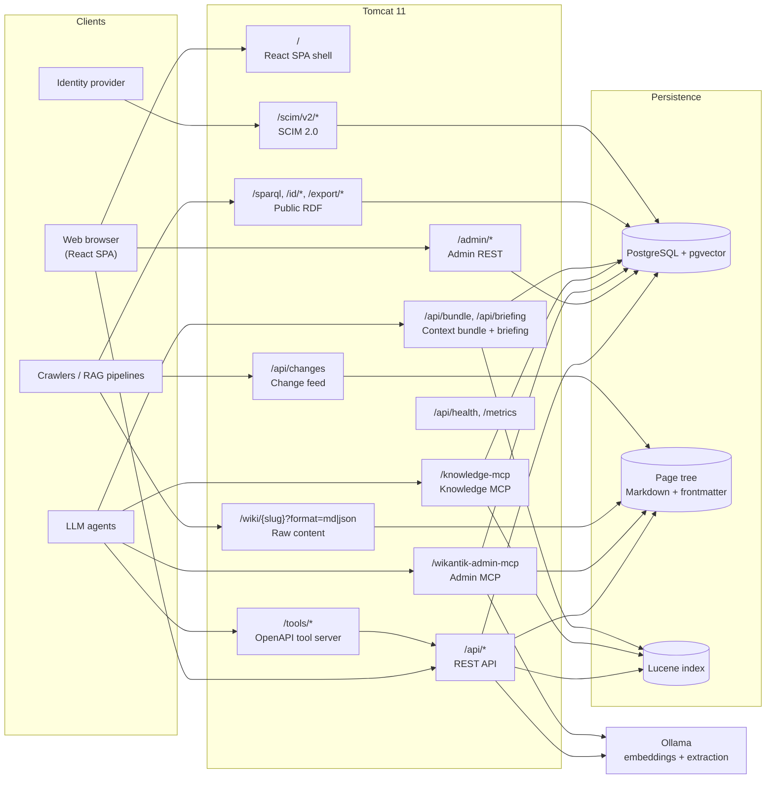

# Wikantik

[](LICENSE)
[](https://openjdk.org/projects/jdk/25/)
[](https://www.postgresql.org/)
[](https://tomcat.apache.org/)
[](https://github.com/jakefearsd/wikantik/actions/workflows/release.yml)
[](https://github.com/jakefearsd/wikantik/commits/main)
[](CODE_OF_CONDUCT.md)

> A Markdown-native knowledge base for people and AI agents: hybrid
> retrieval (BM25 + dense), MCP servers, and a Tomcat 11 / PostgreSQL +
> pgvector backend.

## What is Wikantik?

Wikantik is a Java wiki engine, rebuilt from JSPWiki, that stores pages as Markdown with YAML frontmatter. It serves a React single-page application, a REST API, two Model Context Protocol (MCP) servers and an OpenAPI tool server for AI agents, and exposes health checks, Prometheus metrics and structured logs. Pages are grouped into clusters declared by hub pages, indexed by Lucene for full-text search, and ranked by a hybrid BM25 + dense-vector pipeline.

For agents, retrieval is delivered as a *context bundle*: the wiki ranks, de-duplicates and cites sections, and returns them without synthesizing an answer ([ADR-0001](docs/adr/0001-rag-returns-context-bundle-not-synthesized-answer.md)). Wikantik keeps two graphs apart: the *Page Graph* (real wikilinks) and the *Knowledge Graph* (LLM-extracted entities); see [PageGraphVsKnowledgeGraph](docs/wikantik-pages/PageGraphVsKnowledgeGraph.md).

## Key capabilities

- **Markdown authoring** with frontmatter, wikilinks, embeds and LaTeX math: [Editing](docs/user/Editing.md), [Linking](docs/user/Linking.md), [Frontmatter](docs/user/Frontmatter.md), [MathematicalNotation](docs/user/MathematicalNotation.md)
- **Clusters declared by hub pages**, with multiple memberships per page: [ClustersAndHubs](docs/user/ClustersAndHubs.md)
- **Search**, quick switcher and command palette: [Search](docs/user/Search.md)
- **Comments and @-mentions**, and version-pinned **citations** that flag stale quotes: [CommentsAndMentions](docs/user/CommentsAndMentions.md), [Citations](docs/user/Citations.md)
- **Obsidian vault import and export**: [ObsidianImportExport](docs/user/ObsidianImportExport.md)
- **MCP servers and an OpenAPI tool server** for AI agents; tool lists are in [McpAgents](docs/admin/McpAgents.md)
- **RAG context bundle and session briefing** (`/api/bundle`, `/api/briefing`): [RagContextBundle](docs/admin/RagContextBundle.md)
- **Raw content and change feed** for crawlers and RAG pipelines: [IndexingSupport](docs/admin/IndexingSupport.md)
- **External-source connectors** that sync into derived pages, plus document ingest: [Connectors](docs/admin/Connectors.md), [DerivedPagesAndIngest](docs/admin/DerivedPagesAndIngest.md)
- **RDF/OWL ontology** with public SPARQL and a curated Knowledge Graph: [OntologyManagement](docs/admin/OntologyManagement.md), [KgInclusionPolicy](docs/admin/KgInclusionPolicy.md)
- **LLM spend ceiling** (`wikantik.genai.mode`): [CostTiers](docs/admin/CostTiers.md)
- **Authentication and authorization**: database-backed policy grants and groups, SSO, SCIM, API keys, and a tamper-evident audit log: [Security](docs/admin/Security.md), [SingleSignOn](docs/admin/SingleSignOn.md), [ScimProvisioning](docs/admin/ScimProvisioning.md), [ApiKeys](docs/admin/ApiKeys.md), [AuditLog](docs/admin/AuditLog.md)
- **Admin panel** at `/admin/`: [AdminPanel](docs/admin/AdminPanel.md)
- **Operations**: health, metrics, backups, retrieval-quality and drift dashboards: [WikantikOperations](docs/admin/WikantikOperations.md)

## Why Wikantik?

| Capability | Wikantik | Documented in |
|---|---|---|
| License | Apache 2.0 | [LICENSE](LICENSE) |
| Self-hosted | Yes, container, bare-metal Tomcat, or cloud VM | [GettingStartedGuide](docs/admin/GettingStartedGuide.md) |
| MCP servers for agents | Separate admin (write) and knowledge (read-only) endpoints | [McpAgents](docs/admin/McpAgents.md) |
| OpenAPI tool surface | `/tools/*` | [McpAgents](docs/admin/McpAgents.md) |
| Hybrid retrieval | BM25 + dense (pgvector), falls back to BM25 | [HybridRetrieval](docs/wikantik-pages/HybridRetrieval.md) |
| Knowledge Graph and ontology | LLM-extracted entities, RDF/SPARQL | [OntologyManagement](docs/admin/OntologyManagement.md) |
| Token-budgeted agent page projection | `/api/pages/for-agent/{id}` | [McpAgents](docs/admin/McpAgents.md) |
| Runbook page type and verification | Yes | [Frontmatter](docs/user/Frontmatter.md) |
| Stack | Java 25, Tomcat 11, PostgreSQL + pgvector, React | [Architecture](docs/developer/Architecture.md) |

Wikantik may not fit if you need a hosted SaaS (you run it yourself; [CloudDeployment](docs/admin/CloudDeployment.md) provisions a VM on AWS or GCP), or if you need real-time collaborative editing (the editor is single-author per page). Set `wikantik.genai.mode=none` to run without an inference host, at the cost of hybrid search and the Knowledge Graph ([CostTiers](docs/admin/CostTiers.md)).

## Architecture at a glance


```mermaid
flowchart LR
    subgraph clients [Clients]
        Browser["Web browser<br/>(React SPA)"]
        Agent["LLM agents"]
        Crawler["Crawlers / RAG pipelines"]
        IdP["Identity provider"]
    end

    subgraph tomcat [Tomcat 11]
        SPA["/<br/>React SPA shell"]
        REST["/api/*<br/>REST API"]
        Admin["/admin/*<br/>Admin REST"]
        Raw["/wiki/{slug}?format=md|json<br/>Raw content"]
        Changes["/api/changes<br/>Change feed"]
        Bundle["/api/bundle, /api/briefing<br/>Context bundle + briefing"]
        AdminMCP["/wikantik-admin-mcp<br/>Admin MCP"]
        KnowMCP["/knowledge-mcp<br/>Knowledge MCP"]
        Tools["/tools/*<br/>OpenAPI tool server"]
        RDF["/sparql, /id/*, /export/*<br/>Public RDF"]
        Scim["/scim/v2/*<br/>SCIM 2.0"]
        Health["/api/health, /metrics"]
    end

    subgraph data [Persistence]
        PG[("PostgreSQL + pgvector")]
        Pages[("Page tree<br/>Markdown + frontmatter")]
        Lucene[("Lucene index")]
    end

    Ollama["Ollama<br/>embeddings + extraction"]

    Browser --> SPA
    Browser --> REST
    Browser --> Admin
    Crawler --> Raw
    Crawler --> Changes
    Crawler --> RDF
    Agent --> AdminMCP
    Agent --> KnowMCP
    Agent --> Tools
    Agent --> Bundle
    IdP --> Scim

    REST --> PG
    REST --> Pages
    REST --> Lucene
    Admin --> PG
    AdminMCP --> PG
    AdminMCP --> Pages
    KnowMCP --> PG
    KnowMCP --> Lucene
    Bundle --> PG
    Bundle --> Lucene
    RDF --> PG
    Raw --> Pages
    Changes --> Pages
    Tools --> REST
    Scim --> PG

    REST --> Ollama
    AdminMCP --> Ollama
```

The module map and counts are in [Architecture](docs/developer/Architecture.md).

## Quick start

You need Docker and a clone of this repository.

```bash
cp .env.example .env             # set POSTGRES_PASSWORD
bin/container.sh build           # build the wikantik image
bin/container.sh -e prod up -d   # start Tomcat + PostgreSQL/pgvector
```

[GettingStartedGuide](docs/admin/GettingStartedGuide.md) covers the first admin login, the bare-metal path and common pitfalls. For Docker detail see [DockerDeployment](docs/admin/DockerDeployment.md).

## Documentation

The full index is [docs/README.md](docs/README.md):

- **Users**: [reading, editing, linking and searching pages](docs/README.md#users)
- **Admins**: [install, configure, secure, integrate and operate](docs/README.md#admins)
- **Developers**: [building, testing, architecture and quality](docs/README.md#developers)
- **Archive**: [historical documents](docs/README.md#archive)

## Project

- [Roadmap](ROADMAP.md) and [Changelog](CHANGELOG.md)
- [Contributing](CONTRIBUTING.md) and [Code of Conduct](CODE_OF_CONDUCT.md)
- [Security policy](SECURITY.md) and the operator guide [Security](docs/admin/Security.md)
- Licensed under the Apache License 2.0: [LICENSE](LICENSE), [NOTICE](NOTICE)
- Questions and bug reports: [GitHub Issues](https://github.com/jakefearsd/wikantik/issues)
