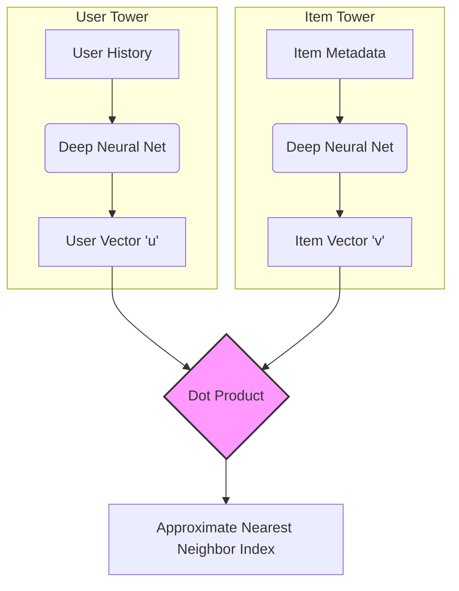

# Recommendation Systems: The Architecture of Latent Discovery

Modern Recommendation Systems (RS) have evolved into massively complex pipelines that balance inference latency, structural awareness, and semantic depth. 

While historical systems relied on classical Matrix Factorization (MF) to approximate the sparse User-Item interaction matrix $R \\approx P Q^T$, the 2024 landscape requires a hybrid synthesis of **Two-Tower Models**, **Graph Neural Networks (GNNs)**, and **Large Language Models (LLMs)**.

---

## I. The Two-Tower Model (Industry Standard Retrieval)

To handle billion-scale item catalogs (e.g., YouTube, Netflix), the system must reduce the candidate pool to a few hundred items in less than 50 milliseconds. The Two-Tower architecture achieves this by fully decoupling the user and item representations.



### The Mathematics of Contrastive Training
Because the towers are decoupled, they are trained to map users and items into a shared inner-product space. This is achieved using the **InfoNCE (Noise Contrastive Estimation)** loss, which maximizes the similarity between a user and their true interacted item while pushing away a batch of $N$ negative items.

Given a user embedding $u$, a positive item $v^+$, and negative items $v_j^-$:

$$
\mathcal{L} = -\log \frac{\exp(u^\top v^+ / \tau)}{\exp(u^\top v^+ / \tau) + \sum_{j=1}^{N} \exp(u^\top v_j^- / \tau)}
$$

*where $\tau$ is the temperature hyperparameter controlling the sharpness of the distribution.*

*   **The Power of ANN:** Because $u$ and $v$ are independent, all item embeddings can be pre-computed and stored in an Approximate Nearest Neighbor (ANN) index like FAISS. At runtime, the system only evaluates the User Tower and performs a rapid geometric vector search.
*   **The Limitation (Pair-Agnostic):** The towers cannot model complex cross-features (e.g., "User A only likes Action Movies if they feature Actor B") because information cannot interact *before* the dot product.

---

## II. Graph Neural Networks (Collaborative Enrichment)

If Two-Tower models treat items as isolated vectors, GNNs mathematically formalize the entire system as a massive bipartite graph, explicitly capturing high-order "collaborative filtering" signals.

```mermaid
graph LR
    U1((User A)) --- I1[Sci-Fi Movie]
    U1 --- I2[Action Movie]
    U2((User B)) --- I1
    U2 -.-? I2
    
    subgraph Message Passing
        I1 -->|Embedding| U2
        U1 -->|Embedding| I1
    end
```

### The Mathematics of LightGCN
Standard GCNs utilize heavy non-linear activation functions. However, **LightGCN** proved that for recommendation (where nodes only have ID embeddings), feature transformation and non-linearities actually degrade performance. LightGCN simplifies the message passing to purely linear propagation over the normalized graph Laplacian.

For layer $k+1$, the user embedding $e_u$ is updated based on its neighboring items $\mathcal{N}_u$:

$$
e_u^{(k+1)} = \sum_{i \in \mathcal{N}_u} \frac{1}{\sqrt{|\mathcal{N}_u||\mathcal{N}_i|}} e_i^{(k)}
$$

*   **Symmetric Normalization:** The term $\frac{1}{\sqrt{|\mathcal{N}_u||\mathcal{N}_i|}}$ discounts the influence of highly popular items (which connect to everything) to prevent embedding collapse.
*   **The Power of Multi-Hop:** By stacking $K$ layers, the embedding $e_u^{(K)}$ absorbs information from $K$-hops away in the graph. If User A and User B share a node (Sci-Fi Movie), the LightGCN mathematically diffuses User A's preference for the Action Movie directly into User B's embedding vector.

---

## III. Large Language Models (Semantic Reasoning)

While GNNs handle topological structure, LLMs handle human context and the dreaded "Cold-Start" problem (when a new item has $\mathcal{N}_i = 0$ connections).

*   **Zero-Shot Embedding via Self-Attention:** By feeding raw text descriptions of a new product into the Transformer architecture, the self-attention mechanism maps the natural language into the exact same latent dimension used by the Two-Tower model. This perfectly positions the new item in the geometric space before anyone has ever clicked on it.
*   **Generative Re-ranking:** In the final stage of a pipeline, an LLM can be prompted to reason over a highly filtered list of candidates: *"User A recently bought hiking boots and a tent. Rank these 5 items and explain the semantic overlap."* This adds profound contextual awareness that dot-products and graph convolutions cannot mathematically express.

---

## IV. The Modern Hybrid Pipeline

Production systems today stack these architectures to offset their respective mathematical weaknesses:

1.  **Stage 1: Retrieval (Two-Tower):** Filters 100,000,000 items down to 1,000 candidates in 10ms using ANN, driven by the InfoNCE contrastive loss.
2.  **Stage 2: Scoring/Enrichment (LightGCN / FIT):** A LightGCN model evaluates the 1,000 items, injecting multi-hop structural graph data to filter the list down to 50 items.
3.  **Stage 3: Re-Ranking (LLM / Heavy DNN):** A computationally heavy model evaluates complex cross-features and semantic intent to rank the final 10 items, generating explainable XAI tags.

---

## References
* [LightGCN: Simplifying and Powering Graph Convolution Network for Recommendation - SIGIR](https://dl.acm.org)
* [ContextGNN: Fusing Two-Tower and Graph Neural Networks for Scalable Retrieval - ArXiv 2024](https://arxiv.org)
* [Large Language Models as Zero-Shot Conversational Recommenders - ESWC 2024](https://eswc-conferences.org)

**See Also:**
- [MachineLearning](MachineLearning)
- [TransformerArchitecture](TransformerArchitecture)
- [DataStructuresHub](DataStructuresHub)
