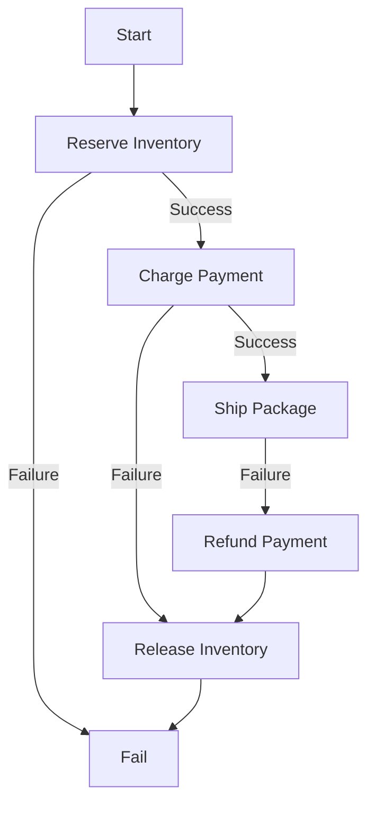

The Saga pattern manages distributed transactions across microservices by breaking a global transaction into a sequence of local transactions. Each step has a corresponding **Compensating Transaction** to undo its effects if a subsequent step fails.

## Core Concepts

1. **Local Transaction:** An atomic change within a single service and its private database.
2. **Compensating Transaction:** An operation that semantically reverses a successful local transaction (e.g., `RefundPayment` reverses `ChargePayment`).
3. **Pivot Transaction:** The "point of no return." Once this step succeeds, the saga must complete; it cannot be compensated.

## Implementation Styles

### 1. Choreography (Event-Driven)
Each service participates in the saga by listening to events and emitting new ones. There is no central coordinator.
- **Pros:** Decentralized, simple for small flows (2-3 steps).
- **Cons:** Cyclic dependencies are common; observability is poor ("What is the state of Order #123?").

### 2. Orchestration (Command-Driven)
A central **Saga Orchestrator** manages the state machine and tells participants when to execute.
- **Pros:** Centralized logic, easy to debug, supports complex branching and retries.
- **Cons:** Tighter coupling to the orchestrator; requires durable state management for the orchestrator itself.

**State Machine (Orchestration):**

## Critical Requirements

### 1. Idempotency
Steps and compensations will be retried. Services must use **[IdempotencyPatterns](IdempotencyPatterns)** (e.g., Fencing Tokens or Deduplication Tables) to ensure that processing the same message twice does not result in duplicate side effects.

### 2. Isolation (The Lack Thereof)
Sagas lack the "I" (Isolation) in ACID. Intermediate states (e.g., "Payment Charged" but "Inventory Not Yet Shipped") are visible to other transactions.
- **Countermeasure:** Use semantic locks (e.g., setting an order status to `PENDING`) to prevent other processes from modifying the data during the saga.

## Tools for Orchestration
- **Temporal / Cadence:** The industry standard for durable execution. It treats sagas as code that can run for seconds or months.
- **AWS Step Functions:** Managed JSON-based state machines.
- **Camunda:** BPMN-based workflow engine.

## Comparison: Saga vs. 2PC

| Metric | Saga Pattern | Two-Phase Commit (2PC) |
|---|---|---|
| **Consistency** | Eventual | Strong (Atomic) |
| **Availability** | High (Non-blocking) | Low (Locks resources) |
| **Scale** | High (Distributed) | Low (Coordinator bottleneck) |
| **Failure Handling** | Compensation | Rollback |

## When to Use
- **Use Sagas** for long-running business processes that cross multiple databases or services.
- **Avoid Sagas** for operations within a single database; use native ACID transactions instead.
